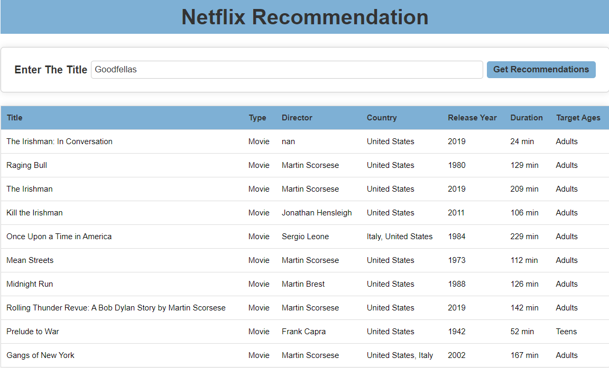
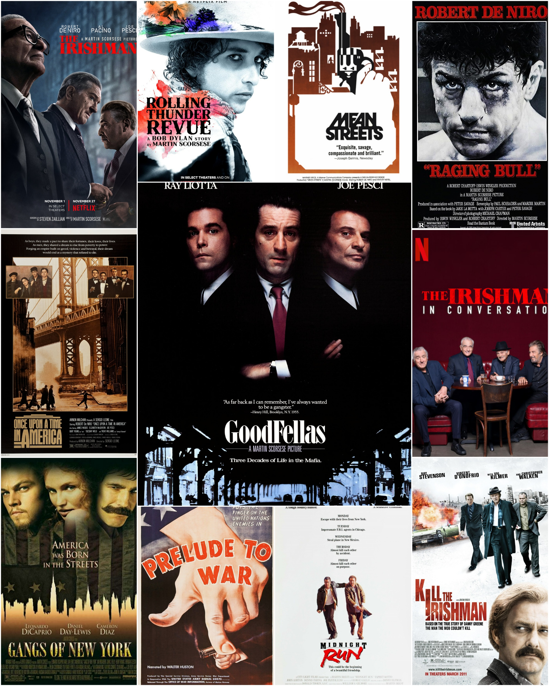

# Netflix-Content-Visualization-and-Recommendation

Welcome to the Netflix-Content-Visualization-and-Recommendation repository! This project combines data analysis, data visualization, and natural language processing techniques to provide personalized content recommendations for movies and TV shows available on Netflix. Users can interact with the system through a user-friendly web page deployed using Flask, HTML, and CSS. The recommendation system employs content-based techniques, including cosine similarity, to suggest content based on textual attributes such as titles, directors, casts, and descriptions.



<hr>



<hr>

## Table of Contents

- [Project Overview](#project-overview)
- [Features](#features)
- [Getting Started](#getting-started)
  - [Prerequisites](#prerequisites)
- [Usage](#usage)
- [Data Analysis and Visualization](#data-analysis-and-visualization)
- [Recommendation System](#recommendation-system)
- [Deployment](#deployment)
- [License](#license)

## Project Overview

This Netflix-Content-Visualization-and-Recommendation system offers a comprehensive solution for exploring Netflix content, generating personalized recommendations, and deploying the recommendation system as a user-friendly web application. Here are the key components of the project:

1. **Data Analysis and Visualization (EDA_Visualization_Netflix.ipynb):**
   - In-depth data exploration and analysis using the netflix_titles.csv dataset.
   - Handling missing values and data type conversions.
   - Visualizing critical insights about Netflix content, including content types, growth trends, ratings, top categories, top production countries, and more.

2. **Data Preparation:**
   - Creating new columns containing text-based information like title, director, cast, listed_in, description, and target_ages.
   - Preprocessing textual data using natural language processing techniques such as tokenization, lemmatization, and stop-word removal.

3. **Recommendation System (Recommendation_Netflix.ipynb):**
   - Building a recommendation system that utilizes a cosine similarity matrix for movies and TV shows based on their textual features.
   - Providing personalized content recommendations based on user preferences and viewing history.

4. **Web Deployment:**
   - Deploying the recommendation system as a user-friendly web page using Flask, HTML, and CSS.
   - Allowing users to interact with the system and receive tailored content suggestions.

## Features

- Comprehensive data analysis and visualization of Netflix content.
- Advanced recommendation system using cosine similarity for accurate suggestions.
- Personalized content recommendations for movies and TV shows.
- Interactive web interface for users to access recommendations.

## Getting Started

## Prerequisites

Before you begin, ensure you have the following prerequisites installed:

- Python
- Jupyter Notebook (for running data analysis and recommendation system notebooks)
- Flask (for web deployment)

You will also need to install the following Python libraries, which can be installed using `pip`:

- `numpy`
- `pandas`
- `scikit-learn` (for `TfidfVectorizer` and `cosine_similarity`)
- `matplotlib`
- `plotly`
- `collections`
- `wordcloud`
- `nltk` (Natural Language Toolkit)

To install the required Python libraries, you can use the following command:
```plaintext
pip install numpy pandas scikit-learn matplotlib plotly wordcloud nltk
```
Download NLTK resources if not already downloaded
- `nltk.download('punkt')`
- `nltk.download('stopwords')`
- `nltk.download('wordnet')`

## Usage

1. Run the Jupyter notebooks for data analysis and the recommendation system:

   - EDA_Visualization_Netflix.ipynb
   - Recommendation_Netflix.ipynb

2. To start the Flask web application for the recommendation system, follow these steps:

   - Open a terminal or command prompt.
   - Navigate to the project directory where your Flask application script (`app.py`) is located.
   - Run the following command to start the Flask application:

     ```plaintext
     python app.py
     ```

3. After running the above command, Flask will start the web application locally. You will see an output indicating that the application is running, and it will provide a local URL (e.g., `http://localhost:5000`).

4. Open a web browser and navigate to the provided local URL to access the recommendation system.

## Data Analysis and Visualization

The data analysis and visualization notebooks provide valuable insights into Netflix content, including:

- **Content Types**: Explore the distribution of movies and TV shows on Netflix.

- **Growth Trends**: The notebooks illustrate the growth of content on Netflix over the years. This includes visualizations that showcase the accumulation of new content added each year, providing insights into how Netflix's content library has expanded over time.

- **Ratings**: Understand the distribution of the ratings for movies and TV shows.

- **Categories and Genres**: The analysis delves into the categorization of content into genres or categories. Users can explore which genres are prevalent on Netflix and identify their preferences. Visualizations may include bar charts or word clouds highlighting popular genres or categories.

- **Production Countries**: Identify the top countries producing content on Netflix.

- **Target Age Distribution**: The notebooks present insights into the target age demographics for different types of content (e.g., children, teens, adults). Visualizations include pie charts showcasing the distribution of content by target age.

These insights help users make informed decisions about their Netflix choices, whether it's based on content type, ratings, genres, or production origin. Enhance your Netflix experience with these data-driven findings.

## Recommendation System

The recommendation system in this project utilizes natural language processing (NLP) techniques and cosine similarity to provide personalized content recommendations for movies and TV shows. Here's a breakdown of how it works:

- **Textual Data Preprocessing**: The recommendation system preprocesses textual data from various attributes, including titles, country, directors, casts, listed_in, descriptions, and target age information. Natural language processing techniques such as tokenization, lemmatization, and stop-word removal are applied to clean and prepare the text data for analysis.

- **Cosine Similarity**: Once the textual data is preprocessed, a cosine similarity matrix is created. This matrix measures the similarity between each pair of movies and TV shows based on their textual features. Cosine similarity is a mathematical technique that quantifies how similar two pieces of text are, allowing the system to identify content with similar attributes.

- **Personalized Recommendations**: When a user interacts with the system, the recommendation engine takes user preferences into account. It compares the user's preferences with the cosine similarity matrix to identify content that aligns with the user's tastes. This personalized approach ensures that users receive content recommendations tailored to their individual preferences.

- **Precise and Engaging Recommendations**: The recommendation system is built to offer accurate and interesting content suggestions. By analyzing the textual attributes of content, it can recommend movies and TV shows that share common themes, genres, directors, or actors, This helps ensure that users get recommendations they're likely to enjoy.

## Deployment

The recommendation system is deployed as a user-friendly web page using Flask, HTML, and CSS. Users can interact with the system to obtain personalized content suggestions and enhance their Netflix experience.

## License

This project is released under the [MIT License](LICENSE), allowing you to use, modify, and distribute it as per the terms of the license.
